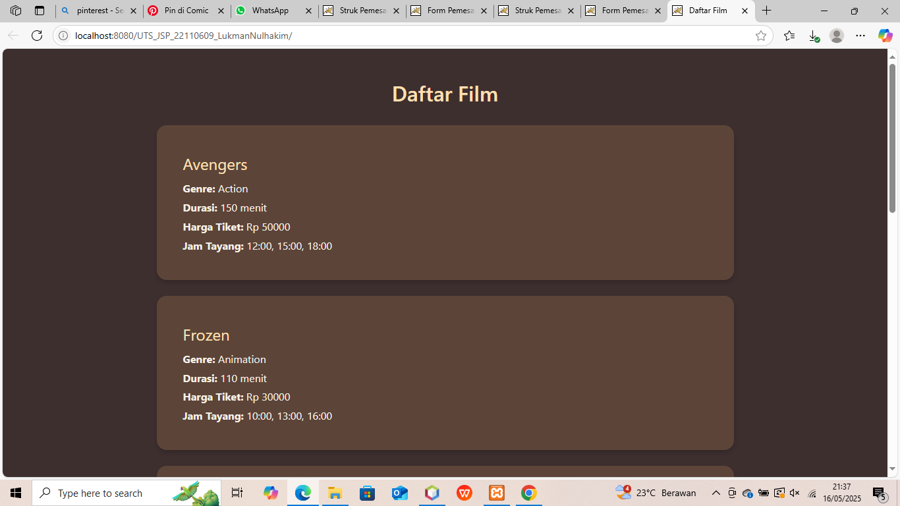
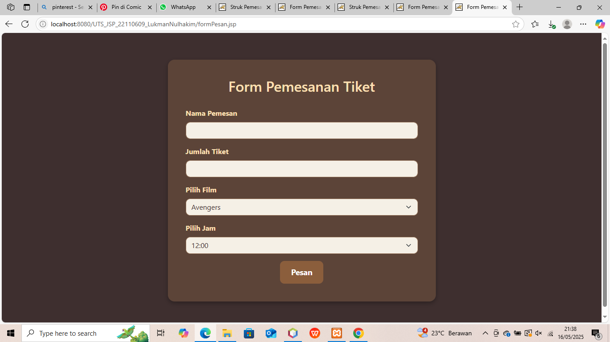
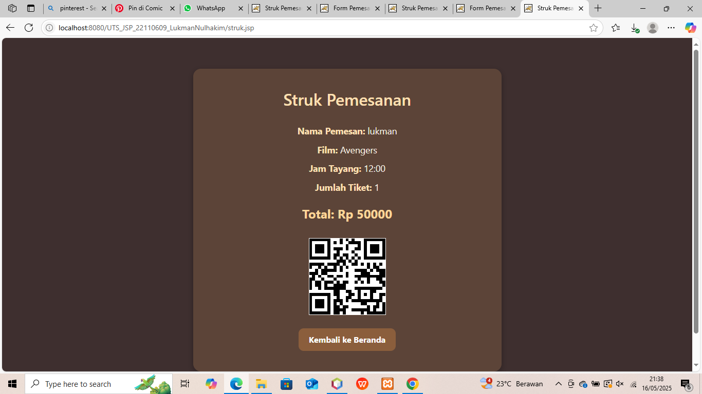

# UTS_JSP_22110609_Lukman_Nulhakim

## 📌 Deskripsi Project

Aplikasi ini adalah sistem pemesanan tiket bioskop berbasis JSP. Pengguna dapat melihat daftar film yang tersedia lengkap dengan detail seperti genre, durasi, harga tiket, dan jam tayang. Pengguna juga dapat melanjutkan ke halaman pemesanan tiket.

## 🖼️ Screenshot Hasil Output






## ▶️ Instruksi Menjalankan Aplikasi

1. Pastikan Anda sudah menginstall:
   - Apache Tomcat (disarankan versi 9 ke atas)
   - JDK (Java Development Kit)
   - IDE seperti IntelliJ IDEA atau Eclipse
2. Clone repository ini:
   ```bash
   git clone https://github.com/Lukman270902/UTS_JSP_22110609_Lukman_nulhakim.git
